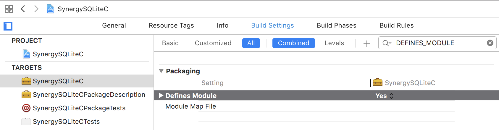

# SynergySQLiteC

_SQLite module package for Swift (built from C source)._

## Contents <a id="contents"></a>
[Subproject Usage](#SubprojectUsage) •
[Original Setup](#OriginalSetup) •
[Ubuntu](#Ubuntu) •
[Resources](#resources-)

## Subproject Usage <a id="SubprojectUsage"></a><sup>[▴](#contents)</sup>

_Steps to use `SynergySQLiteC` as a subproject in another Xcode project._

1. Clone Repository

    ``` bash
    cd WORKING_DIRECTORY
    git clone git@github.com:VaporExamplesLab/SynergySQLiteC.git
    ```

2. Create Xcode project

    ``` bash
    cd SynergySQLiteC

    # for macOS
    swift package generate-xcodeproj --xcconfig-overrides Package.xcconfig
    open SynergySQLiteC.xcodeproj
    ```

3. Verify `DEFINES_MODULE = YES` in Project Editor > Target > Build Settings. _NOTE: `DEFINES_MODULE` still needs to be manually set to YES for C only module._ <br> 

4. Drag and drop SynergySQLiteC.xcodeproj as subproject to the parent Xcode project.

5. In the parent Xcode project, Project Editor > Target > Build Phases:
    * `+` add to Target Dependencies
    * `+` add to Link Binary With Libraries

6. Add `+` New Headers Phase to Build Phases of SynergySQLiteC C target.<br> 

    Note: If needed, first drag & drop add `SynergySQLiteC.h` to the project.  


## Original Setup <a id="OriginalSetup"></a><sup>[▴](#contents)</sup>

_Steps taken to initial setup this project._

``` bash
mkdir SynergySQLiteC
cd SynergySQLiteC
swift package init
git init
git add README.md
git commit -m "first commit"
git remote add origin git@github.com-*:VaporExamplesLab/SynergySQLiteC.git
git push -u origin master

# swift build -Xswiftc "-target" -Xswiftc "x86_64-apple-macosx10.13"
swiftbuild # alias

# swift test -Xswiftc "-target" -Xswiftc "x86_64-apple-macosx10.13"
swifttest # alias

# swift package generate-xcodeproj --xcconfig-overrides Configs/Package.xcconfig
swiftxcode # alias

```

[Download sqlite3 amalgamation](http://sqlite.org/download.html).

``` bash
export SQLITE_VERSION=3270100 # see release history
export SQLITE_YEAR=2019
curl -O http://sqlite.org/$SQLITE_YEAR/sqlite-amalgamation-$SQLITE_VERSION.zip
# Ubuntu: sudo apt-get install unzip
unzip sqlite-amalgamation-$SQLITE_VERSION.zip
```

Move the amalgamation files …

```
|-- sqlite-amalgamation-3270100
|   |-- shell.c
|   |-- sqlite3.c
|   |-- sqlite3.h
|   `-- sqlite3ext.h
```

… into a Swift Package structure. `shell.c` is not used.

```
|-- Package.swift
|-- Package.xcconfig
|-- README.md
|-- Sources
|   `-- SynergySQLiteC
|       |-- SynergySQLiteC.h
|       |-- include
|       |   |-- module.modulemap
|       |   |-- sqlite3.h
|       |   `-- sqlite3ext.h
|       `-- sqlite3.c
```

## Code Tweak

Fix for _`warning: ambiguous expansion of macro 'MAX'`_ or _`'MIN'`_. Search `sqlite3.c` for regex instances of `define.*MIN\W` or `define.*MIN\b`.  Change both `MAX` and `MIN` instances to match `<sys/param.h>` variant:

``` c
/* :EDIT: Macros for min/max. */
#ifndef MIN
#define	MIN(a,b) (((a)<(b))?(a):(b))
#endif /* MIN */
#ifndef MAX
#define	MAX(a,b) (((a)>(b))?(a):(b))
#endif	/* MAX */
```

Added SynergySQLiteC.h umbrella header since, at the time of this writing, an umbrella header is not automatically generated for a C-only package.

## Ubuntu  <a id="Ubuntu"></a><sup>[▴](#contents)</sup>

`swift build` and `swift test` run OK on macOS. `swift build` on Ubuntu produces warnings, however `swift test` executes and passes.

```
Compile SynergySQLiteC sqlite3.c
…/.build/checkouts/SynergySQLiteC.git-9149939184881442794/Sources/SynergySQLiteC/sqlite3.c:1:1: 
  warning: umbrella header for module 'SynergySQLiteC' does not include header 'sqlite3ext.h' [-Wincomplete-umbrella]
/******************************************************************************
^
…/.build/checkouts/SynergySQLiteC.git-9149939184881442794/Sources/SynergySQLiteC/sqlite3.c:1:1: 
  warning: umbrella header for module 'SynergySQLiteC' does not include header 'sqlite3.h' [-Wincomplete-umbrella]
2 warnings generated.
```

## Resources <a id="resources-"></a><sup>[▴](#contents)</sup>

* [SQLite: download page ⇗](https://sqlite.org/download.html)

